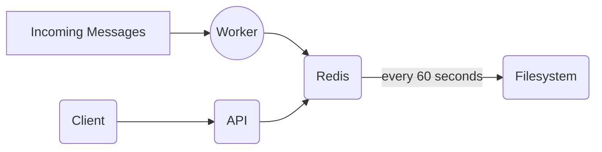

# Chat Statistics App

## Tools and Frameworks

The application is entirely written in typescript and Fastify

Redis has been chosen for storage with periodic persistence enabled

Swagger has been chosen for interactive API documentation

Docker is used for portability and all code written on Manjaro Linux.

## Portable Deployment (Simplest for running this in your machine without installing many dependencies)

I am mentioning this option first since it is the fastest to deploy on any machine that has docker

The only dependency necessary is docker. once docker is installed and configured:

Invoke

```
docker-compose up -d
```

You can subsequently monitor the redis, api and worker containers via:

```
docker-compose logs --tail=all -f api
```

```
docker-compose logs --tail=all -f worker
```

```
docker-compose logs --tail=all -f redis
```

## Local Dev

NOTE: if running the fully dockerized app locally, it will create a redis container using the same port mapping
by default

See the following env files for settings:

.env - Used for local development
.env.docker - Used for the dockerized api where redis is on the ame network as the api

For simplicity, all of the required environment files are in version control

Normally, the `CHAT_INTERFACE_URL` would not be available in version control because it includes a key variable, but
I trust that it is ok for this project. I wanted to make this as easy to stand up as possible
for the reviewer

### List of options

| Name                 | Description                               | Default      | Required |
| -------------------- | ----------------------------------------- | ------------ | :------: |
| `NODE_ENV`           | Node environment                          | 'production' |    F     |
| `NODE_HOST`          | Host for the server                       | '0.0.0.0'    |    T     |
| `NODE_PORT`          | Port the server listen on                 | 3000         |    T     |
| `REDIS_PORT`         | Redis host                                | localhost    |    T     |
| `REDIS_HOST`         | Redis port                                | 6379         |    T     |
| `REDIS_NAMESPACE`    | Redis namespace for all keys              | chat-stats:  |    F     |
| `CHAT_INTERFACE_URL` | The url returning the http message stream |              |    T     |

For tests, the message worker is hard coded to be in text mode and the chat interface stream is mocked
Also, the redis namespace is different for tests so there are no collisions between the application data

You will need to install node version 14 or above and docker

If developing locally, scripts are provided to start the message worker and api and database

### Install

```
yarn install
```

### Start Message Worker

You will need this if you actually want to see meaningful output from the API

```
yarn dev:worker
```

### Start the server and watch for changes

```
yarn dev:watch
```

### Tests

Tests here are implemented as integration tests. The worker and api routes are tested indirectly
Coverage could be better and I would like to spend more time on unit tests, but in the interest of
submitting this soon, I added tests for the core edge cases I could think of specific to the API


```
yarn test
```

### Debugging redis related things

example:

```
DEBUG=ioredis:* npm run dev:worker
```

## API documentation

The api documentation can be visited and explored at:
\<host>:\<port>/documentation

If deployed locally, visit the docs at: localhost:5000/documentation

## Architecture

The application is broken into two main pieces:

- Worker
- API



### Worker

The worker is responsible for processing the HTTP message stream and persisting
All word, nick, rooms and associated counters are managed using Redis's sorted set

Since a sorted set only allows for unique members and is ordered we can easily retrieve
the TOP N most frequent occurrences of words, rooms, and nicks in logarithmic time
proportioned to the amount of elements in the sorted list

Each message is parsed and processed in a single redis pipeline, allowing the worker to
only create a single redis process per message.

Batches were not considered due to the desire for near real time performance

### API

Fastify was chosen due to my familiarity with it already in javascript.

I have forked off the following project since I have experience with javascript,
this saved me a bit of time in terms of boilerplate code:
https://github.com/jellydn/fastify-starter

This was my first real experience writing a good amount of typescript. I would have loved to
build this in go as that's been a language I've been very eager to learn for years
but typescript was closer to home for me so I went with it for the entire project

In addition to the main endpoints:

```
-   /stats - Returns the current messages per second.
-   /stats/words - Returns a list of the top 10 most used words.
-   /stats/nicks - Returns a list of the top 10 nicks (most messages).
-   /stats/rooms - Returns a list of the top 10 rooms (most messages).
```

I have added the following:

```
/stats/failedMessages  - Returns a list of unique messages that failed to process
```

In a real system These wouldn't be publicly accessible but they would be stored off in some internal queue and developers
would be notified periodically that they exist there

Once deployed, visit the interactive documentation explorer at:

```
protocol://host:port/documentation
```

### Persistence

Redis was chosen due to its aforementioned support for sorted sets and its ability to be persisted
and distributed horizontally rather easily if configured with replication

And just to reiterate why sorted sets were chosen for the individual counters, this is taken directly from
the main redis website: https://redis.io/topics/data-types

```
With Sorted Sets you can add, remove, or update elements in a very fast way (in a time proportional to the logarithm of the number of elements).
Since elements are stored in order and not ordered afterwards, you can also get ranges by score or by rank (position) in a very fast way.
Accessing the middle of a Sorted Set is also very fast, so you can use Sorted Sets as a smart list of non repeating elements where you can
quickly access everything you need: elements in order, fast existence test, fast access to elements in the middle!
In short with Sorted Sets you can do a lot of tasks with great performance that are really hard to model in other kind of databases.
```

The official redis image is being used here. For production, this would need to be scaled horizontally using a redis cluster and the key spaces would need
to be adjusted

The overall memory footprint for this demo application is fairly small and would likely require a few gigabytes of ram for the long term

The sorted set can easily be scaled across multiple machines behind a cluster

The default the dockerized redis configuration is used with automatic backups forked in the background every minute
The volume is persisted between the container and the local file system

The test suite and the main application have different namespaces configured to avoid key collisions

#### Alternative approaches

I evaluated the potential for using something like apache flink allowing me to do a map/reduce type of algorithm on the messages in real time
but I did not see a good community for this ecosystem in go or type script / node so I left this alone. I would be curious to try solving
this problem with map/reduce and storing the word counts in a different storage medium. The issue there would be the query responsiveness

An RDBMS like postgresql was briefly considered due to my familiarity.
Fine tuning for updates would make read operations slower. by default postgresql is optimized for reads and I researched
setting the fill factor and auto vacuum settings, but ultimately I went with the NoSQL approach for performance reasons
If we were to tune for an UPDATE heavy application which this is, we would then suffer in terms of READ performance
Reading the TOP N words would be an expensive query, especially with no caching and updating messages as they com in
would be extremely slow. Since batches are not an option here, I felt that postgresql was out of the picture

In addition to postgresql I also considered MySQL since it offers RAM tables, which are supposedly faster than redis
However, the sorted set feature in redis is what sold me on it and why I felt it was the perfect tool for the job

Additionally redis offers Hyperloglog as a data structure which is great for counting. While that feature wasn't useful here, it lead me to finding hte sorted set

## TODOS

Main things left:

- Add tests for messages per second
- Add comments and documentation of parameters

* I did not add a lot of comments or documentation of parameters

- Add type safety to all routes generated from json schemas

* I wanted to implement this and would love to talk about this

- Update tests to properly clear out only test namespace

* For some reason the command to clear out keys for a namespace isn't working
  so I'm flushing the entire system when running tests
* DO NOT run tests while the main worker app is running or if you want to preserve the data

- Profile application beyond the scope of this exercise.

At the top level I added a simple utility using curl to just demonstrate how many messages are received from the interface per second
I noticed that the amount of messages processed per second are on average very similar or close to the amount of messages received per second
so this application achieves near real time for the current data set

## Commit History

Part of the assignment was to make frequent commits. Because i was afraid of typing something incorrectly
and accidentally pushing out of habit to the repo, I worked entirely out of a private repository, and
very frequently making commits and pushing the code

My preferred workflow is to make as many commits as possible and then persisting my work and then
rewriting history to make sense

The reason why I am mentioning this that my commit history is not reflective of my thought process

I'd love to chat about my thought process instead
